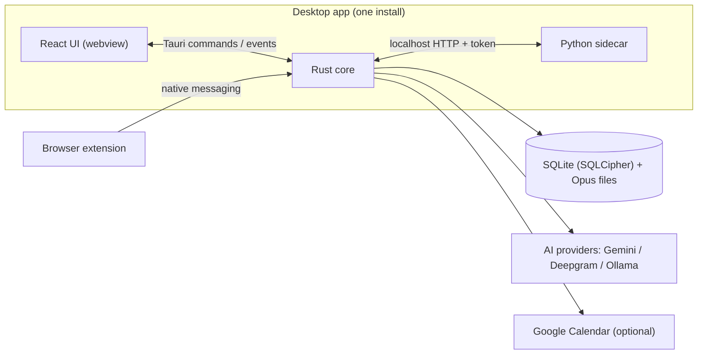
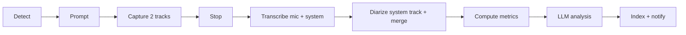

# 04 — Architecture

**Style: modular monolith.** One installed desktop app with clear internal modules, plus one helper process (Python sidecar) for local speech models. Every OS- or vendor-specific piece sits behind a trait.

## Processes

## Rust core modules
| Module | Responsibility | Key types |
| --- | --- | --- |
| `detector` | Watch processes, PipeWire mic/output streams, extension messages, calendar; emit `MeetingDetected` / `MeetingEnded` | `DetectorSource` trait, `MeetingSignal` |
| `consent` | Apply the per-app rule to each detection; prompt as a notification (Record / Not now / Never) and in the window; start recording on Record or an `always` rule; ask "Meeting over?" (Stop / Keep recording) when the meeting seems to end | `ConsentService`, `Notifier` trait, `RecordingControl` |
| `capture` | Record mic + system tracks, encode Opus, write 10 s chunks, live level meters | `AudioBackend` trait (`PipeWireBackend`, `WasapiBackend`, `MacBackend`) |
| `jobs` | Persistent queue; runs pipeline steps; retries with backoff | `Job`, `Step` enum, `Pipeline` |
| `metrics` | Deterministic metrics from segments | `MeetingMetrics` |
| `providers` | STT + LLM calls behind one interface; API keys in the keychain; "Test key"; cost estimates | `Provider` trait, `ProviderService`, `ApiKeys` trait |
| `store` | Migrations, repositories, FTS/vector indexing, encryption key handling | `MeetingRepo`, `SegmentRepo`, … |
| `sidecar` | Spawn on demand, health-check, stop when idle | `SidecarHandle` |
| `commands` | Thin `#[tauri::command]` handlers | — |

## Meeting lifecycle

- Live phase (A–D) runs in-process; capture never waits on the network.
- Post-call steps E–I are rows in `jobs`; each step is idempotent and resumable.
- Queue (ADR-019): one worker thread runs one step at a time, in pipeline order; a step's success queues the next, the last one sets the meeting `ready`. Retryable errors (`AppError.retryable`) come back after 30 s, 2 min, 8 min, 32 min, then 1 h, up to 6 attempts; anything else, or the 6th failure, sets the job and the meeting `failed` (audio kept). At startup `running` jobs are queued again, and `processing` meetings without jobs get their first step.

## Pipeline steps
| Step | Input | Output | Notes |
| --- | --- | --- | --- |
| `transcribe_mic` | mic chunks | segments (`is_me`) | own track → always the user |
| `transcribe_system` | system chunks | segments + diarization labels | provider diarization or sidecar pyannote |
| `merge` | both segment sets | ordered segments | sort by `start_ms`; drop mic segments that duplicate system text within 300 ms (echo) |
| `metrics` | segments | metric rows in `scores` (`kind = metric:*`) | pure Rust, no network |
| `analyze` | transcript + metrics + template | `reports`, `action_items`, `scores` | JSON schema validated |
| `index` | segments, report | FTS rows, embeddings | embeddings optional (S) |
| `notify` | — | `meeting:ready` event + OS notification | |

## Detection on Linux (Fedora)
1. Process watch (`sysinfo`, every 3 s): known binaries (`zoom`, `slack`, `teams-for-linux`, `discord`).
2. PipeWire registry: a capture stream opened by one of those apps or a browser → meeting likely.
3. Browser extension (Phase 3): content script on `meet.google.com`, `*.zoom.us/wc`, `app.slack.com/huddle` reports join/leave.
4. Calendar (S): event with a conferencing link starting within ±5 min raises confidence and supplies title/attendees.
A prompt fires when (1 or 3) AND (2) are true, or on (3) alone. Debounce: one prompt per meeting.

v1 rules (ADR-016, `detector/engine.rs`): the app owning a capture stream comes from the bound node's `application.process.binary`, else its pid via the process list. A desktop app holding the mic 3 s is a meeting (confidence 0.9 when its process is seen, 0.7 when only the stream names it); a browser needs 10 s (0.5). Each app signals once and re-arms after 60 s without the mic. Nothing is signalled while recording or paused. Our own streams are ignored.

End of meeting (ADR-018, `detector/end.rs`), only while a recording runs or is paused: the recording's app, or for a recording started by hand every known app that holds the mic during it, is watched. Its process gone (when it was seen) is `app_closed`; no mic stream for 30 s is `mic_released`. The recorder reports `silence` when both tracks stay under -50 dBFS for 2 minutes. Each prompts "Meeting over?" once per stretch; the user decides.

## Security model
- DB key: random 256-bit key stored in the OS keychain; SQLCipher opens with it. Audio chunks encrypted with the same key (AES-GCM via `aes-gcm`).
- API keys: one keychain entry per provider (`api-key:<provider>` under the bundle identifier), read when a provider is built and sent only to that provider over TLS, in a header marked sensitive. The UI only learns whether a key is saved.
- Sidecar: random port + one-time bearer token passed at spawn; binds to 127.0.0.1 only; receives file paths, not raw audio.
- No remote code, no telemetry. Tauri capabilities restricted to required APIs.

## Flatpak notes
Needs PipeWire and notification portals; global hotkeys via the GlobalShortcuts portal on Wayland. Process watching inside the sandbox is limited — evaluate `--talk-name`/host access early and document trade-offs in `09-decisions.md`.
